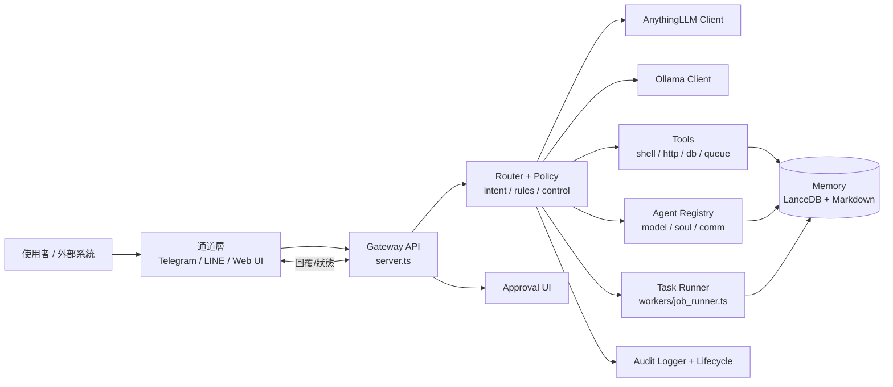
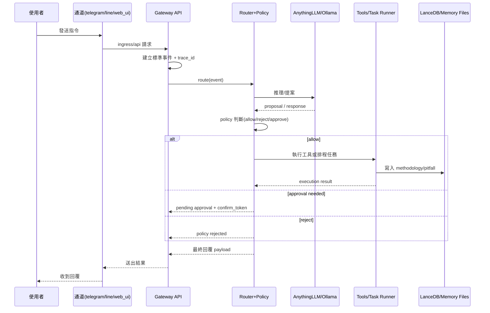

# AnythingLLM Skills 專案總覽（新手視角 + 專家細節）

> 你可以把這個 repo 想成一個「可控的 AI 執行中樞」。
> 它不是只有 prompt，而是把 **通道接入、策略控管、工具執行、任務排程、審計追蹤** 都做成可落地的工程結構。

---

## 1) 這個 repo 實際上有什麼？

目前主要由 4 個可運作區塊構成：

- `gateway/`：核心後端（Node + TypeScript），負責事件路由、policy、tasks、channel control。
- `gateway/web/approval_ui/`：Gateway 內建的審批/控制 UI（靜態頁）。
- `anythingllm-skills/local-file-search-open/`：可直接放入 AnythingLLM 的 skill 範例，工具名稱統一為 `search_local_files`（本機檔案搜尋 + 選擇性開啟 Explorer）。
- `mcp-open-in-explorer/`：Windows-only MCP server，只做 `open_local_file({ path })`。

另外：

- `anythingllm/` 目前是預留掛載目錄說明，不是完整 AnythingLLM 原始碼。
- `flows/*.blueprint.json` 是流程藍圖範例。

---

## 2) 架構資料流（請先理解這段）

## 2.0 近期重構重點：大型 TS 已拆成小模組

如果你之前看過舊版，會記得很多邏輯集中在單一入口檔。
目前已改為「`create_app.ts` 組裝 + `routes/*` 分路由 + `core/*` 分領域 + `workers/*` 背景任務」：

- `gateway/server.ts`
  - 只保留啟動與 graceful shutdown 綁定。
- `gateway/create_app.ts`
  - 負責讀取環境變數、組裝 Router、掛 middleware、註冊所有 route。
- `gateway/routes/*.ts`
  - 每支 API 路由拆成獨立模組（health/channels/command/tasks/memory...）。
- `gateway/core/*.ts`
  - 放業務能力與治理層（policy、agent registry、approvals、tools、memory、lifecycle）。
- `gateway/workers/job_runner.ts`
  - 只處理任務輪詢與執行。

這種拆法的直接好處：

1. 單檔複雜度下降：除錯時可直接定位到對應領域模組。
2. API 風險隔離：某路由調整不會牽連整份 server 入口。
3. 測試粒度更細：可對 `core` 與 `routes` 做定向測試。
4. 後續擴充更穩：新增通道/工具/記憶功能時，不需要再回到巨型單檔修改。

### 2.0.1 `gateway/` 小型 `.ts` 模組用途速查

> 你提到想看「每一個小 ts 的用途」，這裡先列**目前核心運作會用到**的 TypeScript 模組（不含 `__tests__`）。
> 建議閱讀順序：`server.ts` → `create_app.ts` → `routes/*` → `core/*` → `workers/*`。

#### 啟動與組裝

| 檔案 | 主要用途 |
| --- | --- |
| `gateway/server.ts` | 啟動 HTTP server、掛 graceful shutdown、銜接 `create_app.ts`。 |
| `gateway/create_app.ts` | 建立 app instance、註冊 middleware、組裝所有路由。 |
| `gateway/lib/router.ts` | 輕量路由器封裝，提供 route 註冊與 dispatch。 |
| `gateway/lib/errors.ts` | 統一錯誤型別與錯誤回應格式。 |

#### Route 層（API 對外入口）

| 檔案 | 主要用途 |
| --- | --- |
| `gateway/routes/health.ts` | `/healthz` 等健康檢查端點。 |
| `gateway/routes/agent_control.ts` | Agent 開關、模式、權限等控制端點。 |
| `gateway/routes/agents.ts` | 多 Agent 註冊、查詢、更新管理。 |
| `gateway/routes/channels.ts` | Channel 啟用/停用與設定查詢。 |
| `gateway/routes/command.ts` | 主要命令入口（例如 `/api/agent/command`）。 |
| `gateway/routes/tasks.ts` | 任務列表、查詢、取消、刪除、手動觸發。 |
| `gateway/routes/memory.ts` | 記憶寫入（learn）與檢索（search）API。 |
| `gateway/routes/system.ts` | 系統初始化與環境檢查入口。 |
| `gateway/routes/inference.ts` | 推理流程相關 API（模型回覆/提案封裝）。 |
| `gateway/routes/approvals.ts` | 審批流程 API（待審、確認、拒絕）。 |
| `gateway/routes/ingress_telegram.ts` | Telegram webhook ingress。 |
| `gateway/routes/ingress_line.ts` | LINE webhook ingress。 |
| `gateway/routes/ui.ts` | approval UI 靜態資源或入口路徑。 |
| `gateway/routes/types.ts` | 路由共用型別（request context / payload 型別）。 |

#### Core 層（業務能力與治理）

| 檔案 | 主要用途 |
| --- | --- |
| `gateway/core/router.ts` | 核心事件路由與 policy 判斷主流程。 |
| `gateway/core/event.ts` | 標準事件格式、`trace_id` 與事件建模。 |
| `gateway/core/lifecycle.ts` | 系統生命週期狀態（啟動、健康、版本等）。 |
| `gateway/core/channel_control.ts` | Channel 狀態控管（enable/disable/check）。 |
| `gateway/core/agent_control.ts` | Agent 執行控制（模式、限制、策略切換）。 |
| `gateway/core/agents_registry.ts` | Agent 註冊表與 agent metadata 管理。 |
| `gateway/core/agent_messaging.ts` | Agent 間訊息傳遞與通信規則。 |
| `gateway/core/autonomy_hooks.ts` | 自主行為 hook（任務前後鉤子、擴充點）。 |
| `gateway/core/conversation_store.ts` | 對話上下文存取。 |
| `gateway/core/approvals_store.ts` | 審批資料暫存與 token 流程。 |
| `gateway/core/anythingllm_client.ts` | 呼叫 AnythingLLM API 的 client。 |
| `gateway/core/ollama_client.ts` | 呼叫 Ollama API 的 client。 |

#### Policy 子模組

| 檔案 | 主要用途 |
| --- | --- |
| `gateway/core/policy/intent.ts` | 意圖分類/解析（用於路由決策）。 |
| `gateway/core/policy/roles.ts` | 角色權限矩陣與操作邊界。 |
| `gateway/core/policy/rules.ts` | allow/reject/approval 規則實作。 |

#### Tools / Tasks / Proposals / Memory

| 檔案 | 主要用途 |
| --- | --- |
| `gateway/core/tools/shell_command.ts` | 受控 shell 指令執行。 |
| `gateway/core/tools/http_request.ts` | 受控 HTTP 工具呼叫。 |
| `gateway/core/tools/db_query.ts` | DB 查詢工具封裝。 |
| `gateway/core/tools/queue_job.ts` | 工具任務排程進 queue。 |
| `gateway/core/tasks/store.ts` | 任務狀態儲存與查詢。 |
| `gateway/workers/job_runner.ts` | 背景輪詢 queue 並執行任務。 |
| `gateway/core/proposals/schema.ts` | proposal 資料 schema/type 定義。 |
| `gateway/core/proposals/store.ts` | proposal 暫存與讀取。 |
| `gateway/core/memory/evolution.ts` | 經驗萃取（methodology / pitfall）寫入流程。 |
| `gateway/core/memory/ldb_architecture.ts` | LanceDB 記憶索引/檢索整合邏輯。 |

#### Middleware / Audit

| 檔案 | 主要用途 |
| --- | --- |
| `gateway/core/middleware/auth.ts` | API 驗證/授權 middleware。 |
| `gateway/core/middleware/rate_limit.ts` | 流量限制與濫用保護。 |
| `gateway/core/audit/logger.ts` | 審計事件記錄入口。 |
| `gateway/core/audit/persistence.ts` | 審計資料持久化（檔案或儲存層）。 |

#### Connectors（外部通道適配器）

| 檔案 | 主要用途 |
| --- | --- |
| `gateway/connectors/telegram/connector.ts` | Telegram 訊息收發封裝。 |
| `gateway/connectors/line/connector.ts` | LINE 訊息收發封裝。 |
| `gateway/connectors/discord/connector.ts` | Discord 訊息收發封裝。 |
| `gateway/connectors/slack/connector.ts` | Slack 訊息收發封裝。 |

### 2.1 系統架構流程圖



### 2.2 資料流流程圖（一次請求生命週期）



以 `Gateway` 為主的請求流程：

1. 外部通道進入（`/ingress/telegram`、`/ingress/line`、或 UI 走 `/api/agent/command`）。
2. Gateway 建立標準化事件（含 `trace_id`）並記錄 channel activity。
3. Gateway 呼叫 AnythingLLM client 產生 proposal / 回覆內容。
4. Router 套用 policy（允許 / 拒絕 / 待審批）。
5. 依 Agent Registry 決定由哪個 Agent（模型/靈魂/記憶）執行。
6. 工具層（shell/http/db/queue）或 task runner 執行可執行行為，任務以 `agent_id` 隔離。
7. 回覆透過原通道送出（telegram/line）或回傳給 web UI。

**關鍵觀念**：
- AnythingLLM 負責「思考與文字」。
- Gateway 負責「治理與執行控制」。

---

## 3) 先決條件（不先過這關，後面都白做）

- Node.js `>= 20`
- npm / npx
- PowerShell（目前啟動與 bootstrap 主要腳本是 `.ps1`）
- 可用的 AnythingLLM API endpoint + API Key

建議先跑：

```powershell
node -v
npm -v
npx -v
```

---

## 4) 建議第一次操作順序（成功率最高）

### Step 1: 產生基礎環境檔與啟動腳本

```powershell
.\scripts\bootstrap_gateway.ps1
```

這會：
- 檢查 `node/npm/npx`。
- 在缺少時建立 `package.json`。
- 安裝本 repo Gateway 需要的本機 dev tooling（`typescript`, `tsx`, `@types/node`）。
- 檢查並安裝 LanceDB 相關依賴（`lancedb`, `pyarrow`；可用 `-SkipLanceDb` 略過）。
- 建立 `.env.gateway`（若不存在）。
- 建立 `scripts/start_gateway.ps1`（若不存在）。

### Step 2: 初始化依賴（LanceDB / Python）

```powershell
node scripts/init_gateway_env.mjs
```

若你想單獨重跑記憶依賴初始化，可手動執行這步。
這會檢查 `node/npm/python3/pip` 並自動安裝 `lancedb` / `pyarrow`（若缺少）。

> **LanceDB 需要安裝嗎？**
> - 如果你要使用 `/api/memory/search`、`/api/memory/learn`、Agent 自我進化學習與長期記憶檢索：**需要安裝**。
> - 如果你只想先跑最小版指令路由（healthz / lifecycle / agent command）且不碰記憶能力：**可先不安裝**，但相關 API 會不可用或退化。

### Step 3: 先做檢查修復，不急著啟動

```powershell
.\check_and_fix_gateway.ps1 -NoStart
```

這會檢查：
- 指令是否存在（`node/npm/npx/powershell`）
- bootstrap 必要產物是否齊全
- `.env.gateway` 的 `ANYTHINGLLM_API_KEY`、`ANYTHINGLLM_BASE_URL`
- `npx tsx` 能否執行

### Step 4: 啟動 Gateway

```powershell
.\scripts\start_gateway.ps1
```

啟動腳本行為（目前實作）：

### 懶人一鍵安裝（新）

如果你希望用單一入口一次完成安裝，可使用：

```powershell
.\bootstrap_all.ps1
```

常見參數：

- `-Target gateway`：只處理 Gateway
- `-Target open-in-explorer`：只處理 `mcp-open-in-explorer`
- `-RunHealthChecks`：額外跑 Gateway `-NoStart` 檢查與 open-in-explorer 啟動健康檢查
- `-SkipGatewayTooling` / `-SkipGatewayLanceDb`：略過 Gateway 部分安裝
- `-SkipExplorerInstall` / `-SkipExplorerBuild`：略過 open-in-explorer 部分安裝

> 建議：把它當作「入口腳本」，底層仍維持各自 `bootstrap/start` 腳本，這樣既有懶人操作，也保留模組化可維護性。

1. 讀取 `.env.gateway` 注入目前 process 環境。
2. 背景啟動 `npx tsx gateway/server.ts`。
3. 輪詢 `/healthz`（預設等 20 秒）。
4. 自動嘗試開 `http://localhost:8787/approval-ui`（失敗再 fallback 本地 html）。

---

## 5) 啟動後最小驗證（請照順序）

```powershell
Invoke-RestMethod http://localhost:8787/healthz
Invoke-RestMethod http://localhost:8787/lifecycle
Invoke-RestMethod http://localhost:8787/api/channels
```

若 `healthz` 不過，不要先追 Telegram/LINE webhook。

---

## 6) 目前 Gateway 主要 API（精簡版）

- `GET /healthz`
- `GET /lifecycle`
- `POST /lifecycle/soul`
- `GET/POST /api/agent/control`（支援 `agent_id`）
- `GET/POST/PATCH /api/agents*`（多 Agent 管理）
- `GET /api/agent/communications`（Agent 通信拓樸）
- `GET/POST /api/channels`
- `POST /api/agent/command`
- `POST /api/memory/learn`（手動寫入經驗）
- `GET /api/memory/search?q=...`（LanceDB 檢索）
- `POST /api/system/init`（自動檢查/安裝依賴）
- `POST /ingress/telegram`
- `POST /ingress/line`
- `GET /api/tasks`（支援 `agent_id` 篩選）
- `GET /api/tasks/:id`
- `POST /api/tasks/:id/cancel`
- `DELETE /api/tasks/:id`
- `POST /api/tasks/run-once`

---

## 7) 新手最常踩的坑（真實高頻）

1. `.env.gateway` 有值，但其實未被啟動流程載入。
2. `ANYTHINGLLM_BASE_URL` 指到錯環境（例如 staging/prod 混用）。
3. `ANYTHINGLLM_API_KEY` 空值或權限不足。
4. `web_ui` channel 被 disable，造成 `/api/agent/command` 回 503。
5. 直接測 webhook，卻連本機 `healthz` 都還沒過。

---

## 8) 你接下來該讀哪份文件

- 想深入 Gateway：`gateway/README.md`
- 想理解控制台 UI：`gateway/web/approval_ui/README.md`
- 想用本機 skill：`anythingllm-skills/local-file-search-open/README.md`
- 想用 Windows MCP 開檔定位：`mcp-open-in-explorer/README.md`
- 想看 Brain 掛載定位：`anythingllm/README.md`

---

## 9) 一句話收斂

先把 **Gateway 可啟動、可健康檢查、可送 command** 這三件事做穩，再往 webhook 與多工具擴充，會省下大量排錯時間。

---

## 10) Agent 記憶系統（四層拆分版）

已新增可直接落地的記憶結構與規格：

- 主索引：`MEMORY.md`
- 暖記憶：`memory/`（每日、recent、projects、archive）
- 冷記憶：`second-brain/`（summaries、research、devlogs、specs）
- 規格（含時序/效能治理）：`second-brain/specs/system-memory-architecture.md`
- 排程 prompt：`second-brain/specs/scheduler-prompts.md`
- OpenClaw 對齊差異分析：`second-brain/specs/openclaw-gap-analysis.md`

建議先跑最小版本（MEMORY + daily memory + summaries），再擴充到 archive/research 與 QMD。

### 工作流一致性補充
- 查詢效能建議採「先 warm 後 cold」分層查詢，避免每次全庫搜尋。
- weekly compound 與 daily wrap-up 不可同時跑，避免並發寫入。
- `microSync` 只寫 `memory/YYYY-MM-DD.md`。
- `daily wrap-up` 只寫 `second-brain/summaries/`。
- `weekly compound` 才能重寫 `MEMORY.md` 與下沉 archive。
- 所有決策條目建議帶 `session_id / session_path / message_range` 以便回鏈。


## 11) Agent 自我進化學習（LanceDB + 外部檔案同步）

- Agent 在工具成功/失敗後會自動寫入經驗：
  - 成功 -> methodology
  - 失敗 -> pitfall
- 記憶雙寫：
  1) LanceDB（主檢索）
  2) `memory/recent/agent-learning.md`（UI 可直接看）
- 可透過 `GET /api/memory/architecture` 檢查七層檢索架構快照。


## 12) 多 Agent UI 與資料治理（新增）

- Approval UI 已新增 **Agent 管理區**：
  - 可新增子 Agent（name/model/soul/communication_mode）。
  - 可切換目前控制的 Agent，控制面與任務列表都會跟著切換。
- Agent 間通信支援兩種策略：
  - `hub_and_spoke`（主 Agent 為匯流排）
  - `direct`（Agent 彼此直連）
- 儲存策略：
  - 任務：寫入 `agent_id`。
  - 記憶：寫入 `memory_namespace`。
  - 註冊表：`gateway/data/agent_registry.json`。


---

## 11) 實用、可靠、精簡、高效率、聰明 Agent 的 PM 清單（架構面 + 程式細節）

> 目標：避免「修一個點、炸整個系統」；把 Agent 做成可預測、可回復、可持續優化的產品。

### A. 架構面（Architecture）

- [ ] **單一責任分層**：通道接入、路由策略、推理、工具執行、記憶、排程清楚分層。
- [ ] **明確控制面**：具備 pause/resume/stop、channel enable/disable、approval gate。
- [ ] **可觀測性預設開啟**：health、lifecycle、tasks、pending approvals、trace_id 可追蹤。
- [ ] **故障隔離**：某個通道/工具失敗，不拖垮整體服務。
- [ ] **降級策略**：外部依賴（如 LLM / DB）失效時可 fallback、可回報、可暫存。
- [ ] **安全邊界**：request size、timeout、輸入驗證、最小權限。
- [ ] **狀態治理**：任務可取消、可查詢、可重試（至少要可安全中止）。
- [ ] **記憶治理**：短期/長期記憶分層，寫入有節制，檢索有成本上限。

### B. 程式細節（Implementation）

- [ ] **設定防呆**：環境變數 parsing 有 fallback 與 warning（避免非法值直接炸裂）。
- [ ] **API 合約穩定**：統一 response schema（ok/data/error）與錯誤碼語義。
- [ ] **輸入輸出上限**：body bytes、檔案讀取上限、執行 timeout 有預設。
- [ ] **可測性**：至少要有 smoke checks（healthz/lifecycle/關鍵 API）。
- [ ] **回歸保護**：每次改動都能快速做最小驗證（腳本化）。
- [ ] **文件同步**：行為變更時，README / runbook 同步更新。
- [ ] **啟動穩定**：啟動腳本可檢查依賴、補齊缺件、回報可操作建議。
- [ ] **錯誤訊息可行動**：log 要告訴使用者「下一步怎麼修」。

### C. 依此清單審視目前本專案 Agent（現況）

| 面向 | 現況判定 | 說明 |
|---|---|---|
| 分層架構 | ✅ 已具備 | 已拆分 gateway/router/worker/memory/connector，多數責任分離。 |
| 控制面 | ✅ 已具備 | 有 agent control、channel control、approval UI 與 pending action 流程。 |
| 可觀測性 | ✅ 已具備 | 有 `healthz`、`lifecycle`、task 與 route 健康資訊 API。 |
| 安全邊界 | ✅ 已具備（持續補強） | 已有 request body 上限、memory 讀取上限、Ollama timeout。 |
| 設定防呆 | ✅ 已補上 | 數值 env 現在會驗證並 fallback，避免錯值導致異常。 |
| 啟動穩定 | ✅ 已具備 | 有 bootstrap / check-and-fix / start 腳本與 health wait。 |
| 回歸保護 | ⚠️ 需加強 | 目前偏腳本檢查，缺少可持續執行的自動化測試（CI smoke/contract）。 |
| 故障隔離與降級 | ⚠️ 需加強 | 對外部依賴失效雖可回報，但可再增加 circuit breaker / retry budget。 |
| 錯誤可行動性 | ⚠️ 需加強 | 多數訊息可讀，但可再標準化錯誤碼與 remediation 指引。 |

### D. 下一步優先順序（PM 建議）

1. **先補自動化 smoke/contract tests**：鎖住 `healthz/lifecycle/agent command/tasks` 基本契約。
   - 已新增：`node scripts/smoke_gateway_contract.mjs`（檢查 `healthz/lifecycle/channels/inference routes/tasks` 基本契約）。
2. **導入依賴降級策略**：對 LLM、memory backend 增加 timeout + retry budget + 明確 fallback 文案。
   - 已開始：AnythingLLM / Ollama 已加入有限重試（`UPSTREAM_RETRY_MAX_ATTEMPTS`、`UPSTREAM_RETRY_BASE_DELAY_MS`）。
3. **統一錯誤碼與 runbook 對照**：讓 on-call 看到錯誤碼就知道處理流程。
   - 已開始：關鍵 API 回應新增 `error_code`，對照表見 `gateway/README.md`。
4. **建立 release 檢查表**：每次變更前後跑固定檢查，避免「修 A 壞 B」。
   - 已新增：`node scripts/release_checklist.mjs`（整合語法檢查 + smoke contract；可加 `--require-live` 強制 live 檢查必須通過）。


### E. 快速執行契約煙霧測試（新增）

先啟動 Gateway 後執行：

```bash
node scripts/smoke_gateway_contract.mjs
```

可指定目標：

```bash
node scripts/smoke_gateway_contract.mjs --base-url http://localhost:8787 --timeout-ms 4000
```


### F. Release 檢查表（新增）

```bash
node scripts/release_checklist.mjs
```

強制 live 環境必須通過：

```bash
node scripts/release_checklist.mjs --base-url http://localhost:8787 --require-live
```
