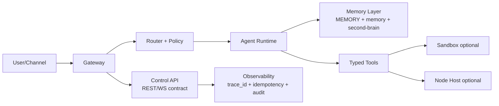

# OpenClaw 差異分析與補強清單（針對目前 AnythingLLM Skills 架構）

## 0) 範圍說明
本文件比較：
- **我們目前 repo**：Gateway + channel adapters + task/tools + memory 四層規格
- **OpenClaw 官方架構心智模型**：單一常駐 Gateway、WS typed protocol、HTTP tools invoke、nodes、sandbox/tool-policy/elevated、plugins/skills、嚴格 config、事件與冪等約束

目標是把「概念對齊」轉成「可執行補強」。

---

## 1) 架構差異總覽（現況 vs OpenClaw）

| 面向 | 我們目前 | OpenClaw 模式 | 差異判定 | 補強方向 |
|---|---|---|---|---|
| 控制平面協議 | REST 為主（`/api/*`） | WS typed protocol + schema validation | 中 | 增加 typed control API 契約與事件模型 |
| 事件可靠性 | 有 trace_id，但缺明確 replay/ack 規則 | events 不重播、client 需 refresh | 高 | 定義 snapshot refresh 與 reconnect 規則 |
| 副作用冪等 | 部分 task 有 id，未統一 idempotency key | 需 idempotencyKey + dedupe cache | 高 | 對有副作用 API 強制 idempotency key |
| 設定治理 | `.env` + script 驗證 | 嚴格 schema，錯即拒啟 | 中高 | 增加 gateway config schema + 啟動前 strict validate |
| 工具安全分層 | policy + approval 概念存在 | tool policy + sandbox + elevated 三層 | 中 | 補三層治理責任與預設 deny 清單 |
| 信任模型 | 偏單機內部服務 | 明確「個人助理，不是敵對多租戶」 | 高 | 補 trust-boundary 指南與分割部署模式 |
| 多 agent 隔離 | 有 channel/policy 控制 | per-agent workspace/sessions/auth profile | 中 | 補 agent 資料/憑證邊界與禁止共享規則 |
| Node 外掛執行 | 目前無 node host pairing | node.invoke + pairing/approval | 中 | 規劃遠端執行面時採 pairing + approvals |
| Plugins / Skills | 以 skills 與本地工具為主 | plugin in-process + skills + typed tools | 低中 | 明確區分「高權限插件」與「低權限技能」 |
| CI 安全閘 | 基本測試為主 | protocol check + secret scan + lane matrix | 中 | 加入 protocol/config/security smoke gates |

---

## 2) 你目前記憶系統與 OpenClaw memory 心智模型的差距

### 已對齊
1. 四層拆分（載入/萃取/儲存/檢索）已成立。
2. `MEMORY.md` 當索引、細節下沉到 warm/cold 已成立。
3. `microSync / daily wrap-up / weekly compound` 責任分工已成立。

### 仍不足（需補）
1. **檢索契約不夠機械化**：目前是文字規格，尚未定義「查詢回傳最低欄位」強制格式。
2. **session 回鏈仍是建議，不是硬性驗證**：`session_id/session_path/message_range` 已在 schema，但缺 lint/check。
3. **衝突決策的狀態機未定義**：只有「記錄覆寫原因」，未定義 active/superseded。
4. **memory 搜尋來源與權限邊界未連動**：還沒把不同來源（archive/research/sessions）與查詢權限分級。

---

## 3) 補強後的目標控制面（建議）



核心補強點：
- 控制面加上 **契約化（schema）**
- 工具面加上 **三層治理（policy/sandbox/elevated）**
- 記憶面加上 **可驗證 metadata 與狀態機**

---

## 4) 可立即落地的補強項目（P0 / P1 / P2）

### P0（本週應完成）
1. 對所有有副作用 API 加 `idempotency_key`（header 或 body）。
2. 為 memory 條目建立最小驗證器（檢查 `id/date/source/session_id/message_range/confidence`）。
3. 為 weekly compound 增加決策狀態欄位：`status: active|superseded|archived`。
4. 新增 `docs/security/trust-boundary.md`，明確聲明非多租戶強隔離模型。

### P1（下週）
1. 定義 control-plane schema（至少針對 `/api/agent/command`、`/api/tasks/run-once`、`/ingress/*`）。
2. 增加 reconnect refresh 流程：事件遺失時如何重建狀態。
3. 補工具風險分級清單（read-only / write / external side-effect）。

### P2（後續）
1. 若引入 node host，必須先做 pairing + approvals 工作流。
2. 若引入 plugins，增加來源信任白名單與版本 pin 規範。
3. 把 protocol check 與 secret scan 納入 CI。

---

## 5) 記憶系統規格補丁（直接可套）

### 5.1 Decision 條目新增狀態機
```md
- status: active|superseded|archived
- supersedes: DECISION-... (optional)
```

### 5.2 Retrieval 最小回應欄位
```json
{
  "query": "...",
  "results": [
    {
      "path": "memory/2026-02-26.md",
      "line_start": 10,
      "line_end": 18,
      "score": 0.87,
      "decision_id": "DECISION-20260226-...",
      "date": "2026-02-26",
      "confidence": "high"
    }
  ]
}
```

### 5.3 週整併輸出補充
weekly compound 除重寫 `MEMORY.md` 外，應額外產出：
- `memory/archive/weekly-YYYY-WW.md`（promote/demote 清單）
- `memory/archive/conflicts-YYYY-WW.md`（互斥決策解法）

---

## 6) 驗證與稽核清單（對齊 OpenClaw 觀念）

1. 安全
- 是否有明確 trust boundary 文件？
- 是否有工具分層與 elevated 審批？

2. 可靠性
- 副作用 API 是否都要求 idempotency key？
- 斷線後是否可透過 snapshot 恢復而非依賴事件重播？

3. 記憶品質
- 條目是否可回鏈（session metadata）？
- 決策是否有狀態（active/superseded）與覆寫歷史？

4. 可運維性
- config 是否可在啟動前 strict validate？
- CI 是否包含 schema/protocol/security gates？

---

## 7) 結論
目前我們的四層記憶架構方向正確，但相較 OpenClaw 仍缺少「**控制平面契約化 + 冪等可靠性 + 信任邊界文件化 + 記憶狀態機**」四個工程化要件。

若先完成 P0，我們就會從「可用的記憶流程」升級為「可治理、可追責、可回放」的準生產架構。
